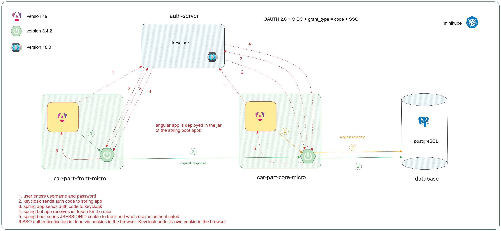

## Car-parts-app
A small application that uses OAUTH 2.0 + OIDC and SSO to log users to the app and retrieve information.
Is used to save car parts in a database and display it to the user.
Car-part-core-micro - used to save car parts in the database
Car-part-front-micro - used to display the parts information to the users of the app.




## Creating the database:

### 1. Run the docker-compose file to generate the PostgresSQL container

### To start the [docker-compose.yml](docker-compose.yml)  container run the below command in the root folder:

````
docker-compose start
````

### 2. Start the application with: ddl-auto: update. This will create the database for you.

````yaml
  jpa:
    hibernate:
      ddl-auto: update
````

### 3. CREATE database with liquibase: add the liquibase dependency and plugin to [pom.xml](car-part-core-micro%2Fpom.xml)

````xml

<dependency>
    <groupId>org.liquibase</groupId>
    <artifactId>liquibase-core</artifactId>
    <version>4.29.2</version>
</dependency>
````
````xml
<plugin>
    <groupId>org.liquibase</groupId>
    <artifactId>liquibase-maven-plugin</artifactId>
    <version>4.29.2</version>
    <configuration>
        <driver>org.postgresql.Driver</driver>
        <url>jdbc:postgresql://localhost:5432/warehouse</url>
        <username>ginitoru</username>
        <password>1234</password>
        <outputChangeLogFile>src/main/resources/liquibase-outputChangeLog.xml</outputChangeLogFile>
    </configuration>
</plugin>
````

### 4. Run the command:
````
mvn liquibase:generateChangeLog
````
### this will generate a xml file that will be used to generate the database for you with liquibase. If you don't want to use
### liquibase for database migration keep ddl-auto: update

### 5. Add the location where the master.xml file is located and set ddl-auto: none (so hibernate will not generate tables etc.)
````yaml
jpa:
  hibernate:
    ddl-auto: none

liquibase:
  change-log: classpath:/liquibase/master.xml
````

### 6. Add the [initiating_database_2024_10_27_001.xml](car-part-core-micro%2Fsrc%2Fmain%2Fresources%2Fliquibase%2Fchangelog%2Finitiating_database_2024_10_27_001.xml) file to [master.xml](car-part-core-micro%2Fsrc%2Fmain%2Fresources%2Fliquibase%2Fmaster.xml) file

### 7. Delete the PostgresSQL container and the volume

### 8. Recreate the PostgresSQL container and start the application. When you start the application liquibase will get into action
### and create the database and all the tables using [master.xml](car-part-core-micro%2Fsrc%2Fmain%2Fresources%2Fliquibase%2Fmaster.xml)  and [initiating_database_2024_10_27_001.xml](car-part-core-micro%2Fsrc%2Fmain%2Fresources%2Fliquibase%2Fchangelog%2Finitiating_database_2024_10_27_001.xml)
### Ho to use liquibase with sql sripts: https://forum.liquibase.org/t/liquibase-works-with-plain-old-sql/6082

### For more information about liquibase: https://www.baeldung.com/liquibase-refactor-schema-of-java-app


# Generate the Api interfaceace using [car-parts-openapi.yaml](car-part-core-micro%2Fsrc%2Fmain%2Fresources%2Fcar-parts-openapi.yaml)

 run the command:
```yaml
mvn clean install
```
to generate the API interface.

## Generate Criteria Query metamodel using the domain model

add this library to the [pom.xml](car-part-core-micro%2Fpom.xml), start the project and metamodel
will be generated in the package: target/generated-sources/annotations

````xml
<dependency>
    <groupId>org.hibernate.orm</groupId>
    <artifactId>hibernate-jpamodelgen</artifactId>
    <version>6.6.1.Final</version>
    <scope>provided</scope>
</dependency>
````

## 10. Blaze-persistence
It is used to create complex queries using criteria api, and escape multiple fetch bag exception
related info:
<br>
https://persistence.blazebit.com/documentation/1.6/entity-view/manual/en_US/#spring-data-features
<br>
https://vladmihalcea.com/blaze-persistence-multiset/
<br>
https://github.com/Blazebit/blaze-persistence/discussions/1410
<br>
In order to make Blaze-persistence work we need to add @EnableBlazeRepositories on the main class. It doesn't work if you add it
on a @Configuration class.
Add @EnableEntityViews(basePackages = "com.gini.model.views") on a configuration class or on the main class so we don't need to 
create a @Bean of type EntityViewConfiguration.
<br>
Dependencies need it for Blaze persistence are:
````xml
        
<dependency>
    <groupId>com.blazebit</groupId>
    <artifactId>blaze-persistence-integration-spring-data-3.3</artifactId>
    <version>${blaze-persistence.version}</version>
    <scope>compile</scope>
</dependency>
<dependency>
    <groupId>com.blazebit</groupId>
    <artifactId>blaze-persistence-integration-hibernate-6.2</artifactId>
    <version>${blaze-persistence.version}</version>
    <scope>runtime</scope>
</dependency>
````

# ANGULAR
in order to use angular material you need to add it to the Angular app:
Go to the Angular parent directory (where angular.json is) and run the command:
````
ng add @angular/material
````
install font awesome:
https://github.com/FortAwesome/angular-fontawesome
https://github.com/FortAwesome/angular-fontawesome/blob/main/docs/usage/icon-library.md#using-the-icon-library

fixing imports of _scss files in components scss files: https://stackoverflow.com/questions/70058183/cant-use-sass-variables-in-angular-from-global-file-despite-other-styles-worki

when building the angular project set the outputPath from angular.json file to:
````
"outputPath": "../src/main/resources/static"
````
angular will generate the build files in the static folder but in a subfolder called ---> browser.


to tell Spring where to look for the index.html file in the application.properties add this code:

````yaml
spring:
  thymeleaf:
    prefix: classpath:/static/browser
    
````

## How to generate interfaces in Angular using .yaml files and openapi generator:
how to use open-pai angular cli generator:
````
https://openapi-generator.tech/docs/installation -> instalation
https://openapi-generator.tech/docs/usage
````

````
https://www.kevinboosten.dev/how-i-use-an-openapi-spec-in-my-angular-projects
https://openapi-generator.tech/docs/usage -> how to use cli
https://stackoverflow.com/questions/62473470/how-do-i-override-the-servers-url-basepath-when-generating-client-using-ope
https://swagger.io/docs/specification/v3_0/api-host-and-base-path/
````

## How to setup Angular environments:
```
https://angular.dev/tools/cli/environments
```
Generate environments:
```
ng generate environments
```
After creating the local environment run the comand to buit with the local values:
```
ng build --configuration local
```

## Maven multi-module project
To run all the project in the same window of the Intellij IDEa IDE go to the Maven icon
on the right side and push the  + button and then select the directory car-part-front-micro
and car-part-core-micro and then save.

# Deploy to Minikube:

- write dockerfile
```dockerfile
FROM eclipse-temurin:21-alpine-3.21

COPY target/*.jar app.jar

ENTRYPOINT ["java","-jar","/app.jar"]
```
- create docker image:
```
1.Create docker image: docker build -t car-part-core-micro:1 .
2.Rename docker image: docker tag car-part-core-micro:1 ginitoru/car-part-core-micro:1
3.Push docker image to Dockerhub: docker push ginitoru/car-part-core-micro:1
4.See vurnelabilities on the image: docker scout quickview ginitoru/car-part-core-micro:1
5.Recomandation: docker scout recommendations: ginitoru/car-part-core-micro:
```

### create Ingress yaml file 
```
Enable ingress: minikube addons enable ingress
Enable DNS: minikube addons enable ingress-dns
Example: https://stackoverflow.com/questions/58561682/minikube-with-ingress-example-not-working

Add this to: C:\Windows\System32\drivers\etc\hosts so it can map the IP to DNS
127.0.0.1 car.core.ro
127.0.0.1 car.front.ro
127.0.0.1 keycloak.ro
```
## finalize deployment
The images of the app is uploaded to dockerhub.com
From the console go to each kubernetes file of each app and run the command for each yaml file.
````
kubectl apply -f care-core-micro.yaml
run this command for each yaml file in the kubernetes folder.
You will need to have a minikube app running.
````


### Gitlab ci-cd
This files are used to run the pipeline and deploy the docker image in the gitlab container registry.
<br/>
car-part-core-micro - [.gitlab-ci.yml](car-part-core-micro/.gitlab-ci.yml)
<br/>
car-part-front-micro - [.gitlab-ci.yml](.gitlab-ci.yml)